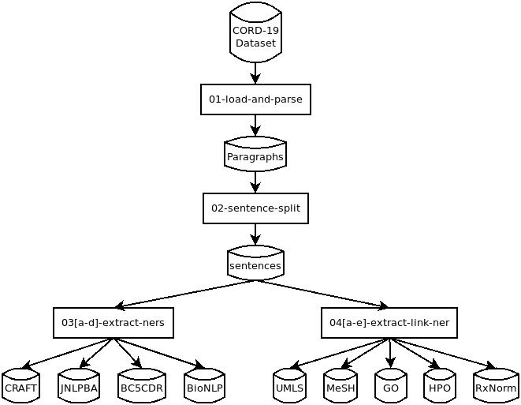
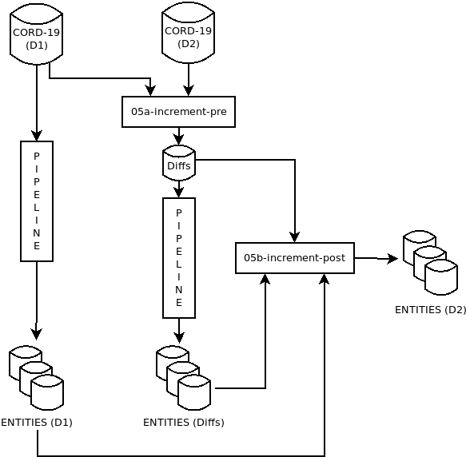

# saturn-scispacy

This repository contains code to extract biomedical entities from the [CORD-19 dataset](https://allenai.org/data/cord-19) using trained models from the [SciSpaCy](https://allenai.github.io/scispacy/) project. Outputs from this project are a set of Parquet Dataframes containing entity annotations against the CORD-19 dataset using SciSpaCy pre-trained NER models, and a set of notebooks to generate these annotations from the CORD-19 dataset. These Dataframes can be used for downstream NLP tasks in the biomedical domain. 

The work was carried out on the [Saturn Cloud](https://www.saturncloud.io/s/) platform, and was a joint effort between Elsevier Labs and Saturn Cloud.

## Code Structure

Code is in [Jupyter notebooks](https://jupyter.org/) using [Dask](https://dask.org/). The `notebooks` folder contains three subfolders, `dev`, `full`, and `incremental`. The `dev` notebooks were used to develop the full pipeline, and are identical to the `full` notebooks, except for the choice of scheduler.

* `dev` -- extracts a random 0.5% sample of the full CORD-19 dataset, parses the `metadata.csv` and JSON files (where available) to extract paragraphs, uses the SciSpaCy `english_md` language model's sentence splitter to extract sentences from paragraphs, and then uses the 9 NER models (listed below) to extract entities from the sentences. Output is a set of Parquet files of paragraphs, sentences, and entities. These notebooks all use the local distributed scheduler.
* `full` -- identical to the `dev` set of notebook, except that the distributed scheduler used is the one provided by Saturn Cloud. Partitions the job across a cluster of 10 machines. Input is the entire CORD-19 dataset, and output is a much larger set of Parquet files containing all paragraphs, sentences, and entities from the CORD-19 dataset.
* `incremental` -- builds up the Parquet dataset using the `full` output from a previous run, and the new CORD-19 dataset. Compares `metadata.csv` files to find added and deleted papers, then runs the pipeline to extract paragraphs, sentences, and entities only for the papers added in the new CORD-19 dataset. These are then merged with the old outputs to create the new dataset against the new CORD-19 dataset. In addition, all paragraph, sentence, and entity rows that are linked to deleted papers in the new CORD-19 dataset are removed. This is cheaper to run in terms of processing power, since entity extraction is comparatively expensive, and we eliminate a lot of this by processing only the added papers.

## Pipeline Architecture

### Full Pipeline

The figure below shows the full processing pipeline. The 01-load-and-parse notebook extracts the title, abstract, and JSON body (where available) for each document in the CORD-19 dataset, and writes them out as a Parquet file of paragraphs. The 02-sentence-split notebook uses the sentence splitter provided by SciSpaCy’s language model to split these paragraphs into sentences. The notebooks 03[a-d]-extract-ners apply one of the four NER models in the first set to produce Parquet files of entity annotations. Similarly, the notebooks 04[a-e]-extract-link apply the SciSpaCy language model to extract candidate spans and use one of the five entity linkers to produce Parquet files of entity annotations. The format of both types of entity annotations are identical so they can be mixed and matched if needed. In addition, we provide the paragraphs and sentences as part of our annotation dataset.



### Incremental Pipeline

While it is possible to generate a new entity dataset from different versions of the CORD-19 dataset using the full pipeline described above, it can be cheaper in terms of processing to use the incremental pipeline instead. The figure below shows the incremental pipeline. It needs the input CORD-19 dataset and output entity annotations from a previous full run on some date D1. To do an incremental run on a future date D2, we would also need the CORD-19 dataset for that date. The 05a-increment-pre notebook compares the metadata file for both CORD-19 datasets and generates a list of deletions and additions, i.e., papers that were in the D1 dataset but not in D2, and vice versa. The additions are used to drive the full pipeline, but only on the papers in the addition list, which can be quite small compared to the full dataset. In our experiment, where we ran the incremental pipeline using datasets about a month apart (D1 = September 28 2020 and D2 = October 28 2020), there were 2,162 deletions and 44,536 additions. The task completed in minutes instead of hours. Finally, the 05b-increment-post notebook merges the entities from the full run against D1 and the incremental run against D2 and deletes the entities in D2 corresponding to the deleted records.



## NER Models used for Entity Extraction

SciSpaCy provides two different classes of entity recognition models. The first class is what is commonly known as Named Entity Recognition (NER) models, and identifies spans of text in incoming sentences as belonging to a single entity type. The second class, commonly known as a Named Entity Recognition and Linking (NERL) model, involves a two step process, first identifying candidate spans in text, then linking it to an entry in an ontology. In this case, a candidate span can map to different entries in the ontology, and entries are ranked by a score indicating the quality of the match.

The 4 SciSpaCy NER models that we used are all biomedical NERs trained on the CRAFT, JNLPBA, BC5CDR, and BioNLP datasets respectively. We also used 5 NERL models used the SciSpacy language model to identify entity spans, and models that matched against Unified Medical Language System (UMLS), Medical Subject Headings (MeSH), Gene Ontology (GO), Human Phenotypes Ontology (HPO), and RxNorm ontologies.

## Dataset Output Format

Output is generated as sets of [Apache Parquet](https://parquet.apache.org/) files, one set each for paragraphs and sentences, and one set for each NER model listed above. All the entity Parquet files share a common format. The formats are described in the tables below.

### Paragraphs

| Column Name | Type   | Description |
|-------------|--------|-------------|
|cord_uid     | String | A unique ID given to each paper by the CORD-19 system.|
|pid          | String | Paragraph ID. Titles have pid=T, Abstracts and Full text have pids that start with A and B respectively, followed by the running sequence number of the paragraph.|
|ptext        | String | Paragraph Text|


### Sentences

| Column Name | Type    | Description |
|-------------|---------|-------------|
| cord_uid    | String  | Inherited from Paragraph. |
| pid         | String  | Inherited from Paragraph. |
| sid         | Integer | Running sequence number indicating the sentence number within the paragraph. |
| stext       | String  | Sentence Text |


### Entities

| Column Name    | Type    | Description |
|----------------|---------|-------------|
| cord_uid       | String  | Inherited from Paragraph and Sentence. |
| pid            | String  | Inherited from Paragraph and Sentence. |
| sid            | Integer | Inherited from Sentence. |
| eid            | Integer | Running sequence number indicating entity within sentence. |
| eclass         | String  | Name of NER or linking model, e.g., craft or umls respectively. |
| etext          | String  | Text span in sentence representing the entity. |
| elabel         | String  | Entity type label predicted by the NER model, or concept ID of matching concept predicted by the Entity Linking model. |
| escore         | Float   | Number between 0 and 1 indicating the strength of the match. NER models return a single prediction and no confidence score, so this is always set to 1. Linking models can return one or more predictions ranked by confidence score. |
| ent_start_char | Integer | Starting character offset within the sentence for the entity span given by etext. |
| ent_end_char   | Integer | Ending character offset within the sentence for the entity span given by etext. |


## Dataset location

Dataset is available on S3 with requester-pays flag set. This means that you will need to pay for the network bandwidth consumed during the download process. This is generally only an issue if you are transferring data out of AWS. The estimated cost of transferring the entire dataset (all 3 folders) out of AWS, as calculated mid October 2020, was between $3.60 and $6.00 depending on your AWS usage.

You can access the data on S3 [here](https://s3.console.aws.amazon.com/s3/buckets/els-saturn-scispacy/cord19-scispacy-entities/?region=us-east-1&tab=overview) using the AWS console. Equivalently, you can use the following AWS CLI commands to view the top level directory structure, and corresponding `aws cp` commands with the `--recursive` option to copy the files to their own area.

```
$ aws s3 ls s3://els-saturn-scispacy/cord19-scispacy-entities/ --request-payer requester
             PRE 2020-08-28-small/
             PRE 2020-08-28/
             PRE 2020-09-28/

$ aws s3 ls s3://els-saturn-scispacy/cord19-scispacy-entities/2020-08-28/ --request-payer requester
             PRE cord19-ents-bc5cdr-pq/
             PRE cord19-ents-bionlp-pq/
             PRE cord19-ents-craft-pq/
             PRE cord19-ents-go-pq/
             PRE cord19-ents-hpo-pq/
             PRE cord19-ents-jnlpba-pq/
             PRE cord19-ents-mesh-pq/
             PRE cord19-ents-rxnorm-pq/
             PRE cord19-ents-umls-pq/
             PRE cord19-paras-pq/
             PRE cord19-sents-pq/

```

The dataset is also registered as a [Mendeley Dataset](https://data.mendeley.com/datasets/gk9njn3pth/2) titled "CORD-19 SciSpaCy Entity Dataset". If you find this dataset useful in your research, please cite it as: 

> Pal, Sujit (2020), “CORD-19 SciSpaCy Entity Dataset”, Mendeley Data, V2, doi: 10.17632/gk9njn3pth.2.

